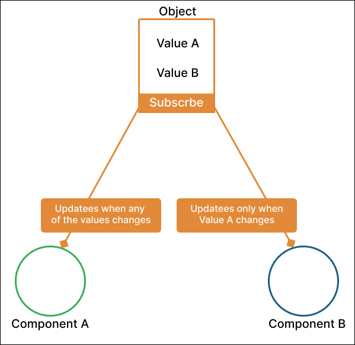

# statestore.js
A state management library for reactively and selectively updating parts of applications.

## The basic idea behind statestore.js    
Given an internal state (an object), every part of the application should be able not only to access the object  
but also be able to subscribe selectively to changes made in the values of the object. The figure below shows a practical 
example of how statestorejs ensures selectivity in triggering change events.     

In the figure below, both componnent `A` and `B` subscribes to be updated when there are changes in the values of the object. 
Component `B` does not depend on `value B` or changes in `value B` has no effect on component `B` therefore, never updates (or re-executed) 
until there's a change in `value A`. That is how statestorejs ensure selectivity in updates (and/or re-renders in Reactjs) applications.    


## A simple demo in any JavaScript or TypeScript applications
This is a test with the usage of statestore.js to pass data from one function to the other.    

```ts

import { type ContextId, createContext, getContext, subscribeToContext, updateContext } from "statestorejs";

type UserInfo = { username: string, fulname: string}
function App(){
    const [contextId, context] = createContext({ username: 'KBismark', fulname: 'Bismark Yamoah'});

    //Simulates userinfo update after 2 secods
    setTimeout(() => {
        // Change username
        updateContext(contextId, context, {actors: ['username'], context: {username: 'KBis'}})
    }, 2000);

    // Show current user info
    ShowUserInfo(contextId)
}


// Logs user info when user info is updated in the App method
function ShowUserInfo(propsAccess:  ContextId){

    const actualProps = getContext<UserInfo>(propsAccess);
    console.log(actualProps);

    // Performs some task
    SomeCPUIntensiveTask() 
    
    
    // Subscribe to changes in username only
    subscribeToContext<UserInfo>(
        propsAccess,
        { watch: ['username'], action: (newProps)=>console.log(newProps) }
    )
}

function SomeCPUIntensiveTask(){
    console.log('Performed some intensive task...');
}

App(); // Start app

```

