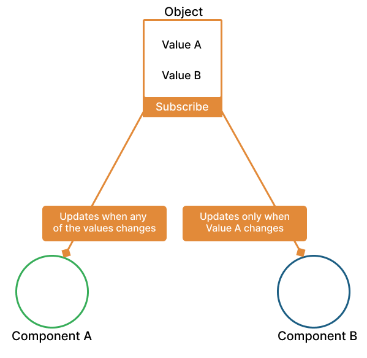

# statestore.js
A state management library for reactively and selectively updating parts of applications.

## The basic idea behind statestore.js    
Given an internal state (an object), every part of the application should be able not only to access the object  
but also be able to subscribe selectively to changes made in the values of the object. The figure below shows a practical 
example of how statestorejs ensures selectivity in triggering change events.     

In the figure below, both componnent `A` and `B` subscribes to be updated when there are changes in the values of the object. 
Component `B` does not depend on `value B` or changes in `value B` has no effect on component `B` therefore, never updates (or re-executed) 
until there's a change in `value A`. That is how statestorejs ensure selectivity in updates (and/or re-renders in Reactjs) applications.   



## A simple demo in any JavaScript or TypeScript applications
This is a test with the usage of statestore.js to pass data from one function to the other.    

```ts

import { type ContextId, createStore, getStore, subscribe, updateStore } from "statestorejs";

type UserInfo = { username: string, fulname: string}
function App(){
    const provider = 'storage_provider_name'
    const storename = 'store_name'
    createStore<UserInfo>(provider, storename { username: 'KBismark', fullname: 'Bismark Yamoah'});

    //Simulates userinfo update after 2 secods
    setTimeout(() => {
        // Change username and course all subscribers listening to changes in the 'username' field
        updateStore<UserInfo>(contextId, context, {actors: ['username'], store: {username: 'KBis'}})
    }, 2000);

    // Show current user info
    ShowUserInfo()
}


// Logs user info when user info is updated in the App method
function ShowUserInfo(){
    const provider = 'storage_provider_name'
    const storename = 'store_name'
    const actualProps = getStore<UserInfo>(provider, storename);
    console.log(actualProps);

    // Performs some task
    SomeCPUIntensiveTask() 
    
    // Subscribe to changes in username only
    subscribe<UserInfo>(
        provider, storename,
        // Subscribe to the store and listen to changes in only the 'username' field
        { watch: ['username'], action: (store)=>console.log(store.username, store.fullname) }
    )
}

function SomeCPUIntensiveTask(){
    console.log('Performed some intensive task...');
}

App(); // Start app

```


## APIs and Methods

### createStore(provider, storeId, storedata)    
 Sets a store in a storage provider. If no storage provider with the name &lt;`provider name given`&gt; exists, 
 a new storage provider with &lt;`provider name given`&gt; is created before the store is created.    

 **@param** `provider` Storage provider's name
 **@param** `storeId` Store identifier. A unique string that is used to access a store from a storage provider.
 **@param** `storedata` The data to be stored        


### getStore(provider, storeId, cb)    
 Gets a copy of a store's data from a storage provider. This function returns a copy of the store if no callback is provided. 
If a callback is provided, then it returns the value returned by the callback. If no such store exists in the storage provider, null is returned.    

 **@param** `provider` Storage provider's name
 **@param** `storeId` Store identifier. A unique string that is used to access a store from a storage provider.
 **@param** `cb` Optional callback that receives a copy of the store as argument if the store exists. This callback has no effect if store does not exist.         


### updateStore(provider, storeId, options)    
 Updates and trigger listners of a store data.    

 **@param** `provider` Storage provider's name
 **@param** `storeId` Store identifier. A unique string that is used to access a store from a storage provider.
 **@param** `options` Update configuration object.         

### subscribe(provider, storeId, options)    
Subscribe to changes in a store's data or specific fields in the store. This method returns a sunscription id 
that can be used to unsubscribe to the service. **Make sure to unsubscribe when not needed.**    

 **@param** `provider` Storage provider's name
 **@param** `storeId` Store identifier. A unique string that is used to access a store from a storage provider.
 **@param** `options` Subscription configuration object. 

 ### unsubscribe(provider, storeId, subscriptionId)    
 Unsubscribe to changes in a store's data.    

 **@param** `provider` Storage provider's name
 **@param** `storeId` Store identifier. A unique string that is used to access a store from a storage provider.
 **@param** `subscriptionId` The subscriptionId of the subscription to cancel.

### deleteStore(provider, storeId)    
 Removes a store from a storage provider   

 **@param** `provider` Storage provider's name
 **@param** `storeId` Store identifier. A unique string that is used to access a store from a storage provider.        


### deleteProvider(provider)    
Clears and removes a storage provider if exists.   

 **@param** `provider` Storage provider's name    


## Usage in Reactjs and React Native
The following two methods ar specifically to be used in reactjs applications.    

### configureForReact(React)    
Configures and setup statestorejs for use in react or react native.    
```ts 
    import React from 'react'
    import { configureForReact } from 'statestorejs'
    // Configure statestorejs
    configureForReact(React);    

```     


### useStateStore(provider, storeId, watch)    
A react hook that takes care of subscription and unsubscriptions automatically. 
The hook allows components to subscribe to stores when mounted and unsubscibe when unmounted.    

 **@param** `provider` Storage provider's name
 **@param** `storeId` Store identifier. A unique string that is used to access a store from a storage provider.
 **@param** `watch` Optinal array of fields to watch for changes in a store's object. When empty, `[]`, the method 
 only returns the store's data without any subscription. When not provided or undefined, causes component to update on changes in 
 the value of any of the fields in the store's object.        

```ts 
    import React from 'react'
    import { configureForReact, createStore } from 'statestorejs'
    // Configure statestorejs
    configureForReact(React);   
    
    type User = {username: string; age: number};

    createStore<User>('some_provider', 'some_store', {username: 'John', age: 34})
    
    const UserDetails = ()=>{
        // Subscribes and watches the 
        const {username} = useStateStore<User>('some_provider', 'some_store', ['username']);

        return (/* ... */)
    }

```    

